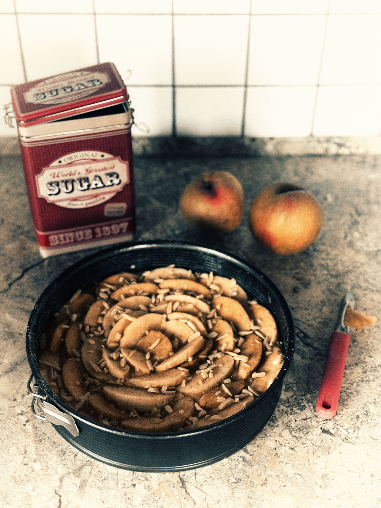
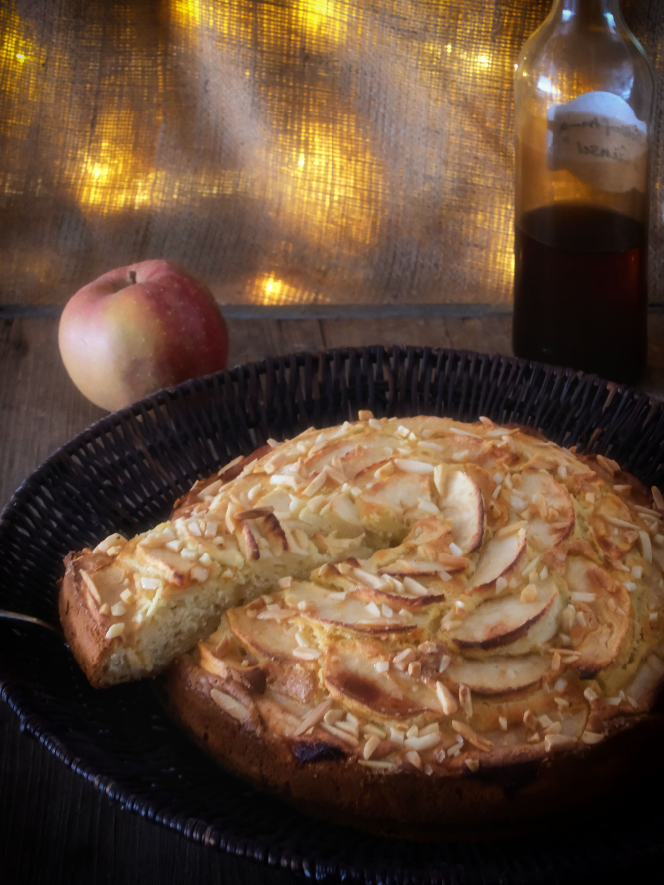
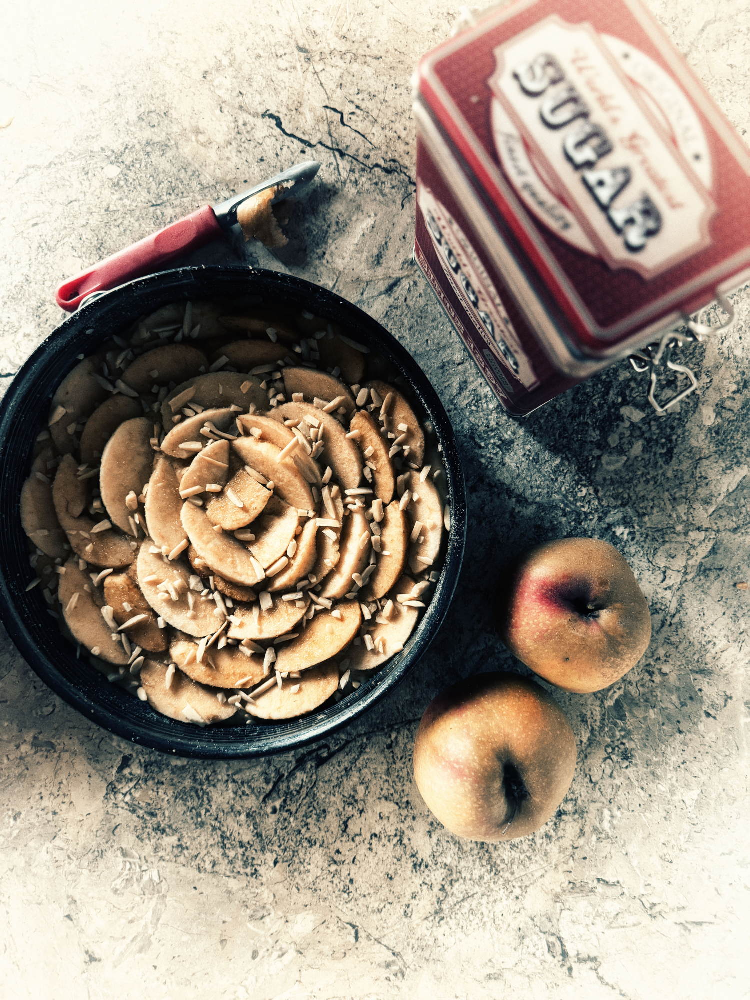


<li>3 Eier</li>
<li>150 g Zucker</li>
<li>50 ml Milch</li>
<li>60 g geschmolzene Butter</li>
<li>300 g Weizenmehl (Typ 405)</li>
<li>1 Pck. Backpulver</li>
<li>3 große Äpfel</li>
<li>50 g Marzipan</li>
<li>Butter für die Form</li>
<li>etwas brauner Zucker</li>
<li>gehackte (Wal-/Hasel)-Nüsse / Mandeln</li>



<li>Eier in einer Schüssel aufschlagen und mit der Kitchen Aid schaumig verrühren. Den Zucker hinzugeben und weiter verrühren, bis sich der Zucker aufgelöst hat. Die Milch hinzugeben und ebenfalls gut verrühren.</li>
<li>Butter in die Eimischung geben und unterrühren. Das Mehl nach und nach hinzufügen und gut mit der Eimischung vermengen. Das Backpulver unter den Teig rühren.</li>
<li>Backofen auf 170 °C (Umluft) vorheizen. Eine Springform mit Butter fetten und mit Gries oder Semmelbrösel bestreuen.</li>
<li>Äpfel schälen, vierteln und vom Kerngehäuse befreien. 1 Apfel und den Marzipan in kleine Würfel schneiden und diese unter den Teig heben. Den Teig in die vorbereitete Springform füllen und glattstreichen.</li>
<li>Die anderen beiden Äpfel in schmale Spalten schneiden. Die Spalten in Kreisform auf dem Kuchenteig verteilen, sodass sich ein Rosenmuster ergibt. Die Oberfläche mit 3 Prisen braunen Zucker und den gehackten Nüssen bestreuen.</li>
<li>Die Torta di Mele im heißen Ofen (Mitte) ca. 45 Minuten backen. Den Kuchen anschließend etwas auskühlen lassen und erst dann aus der Form lösen.</li>




