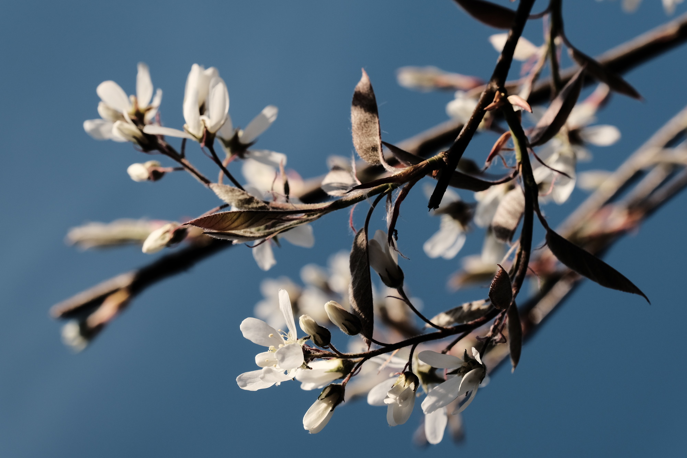
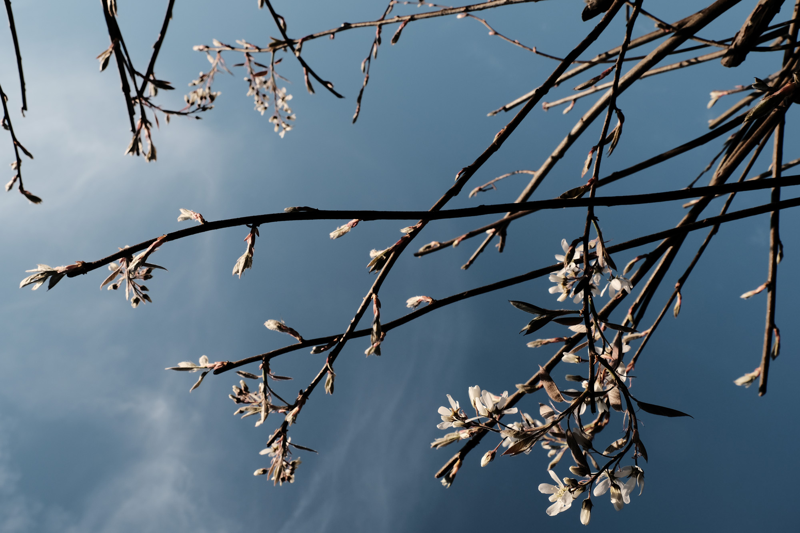

Der Frühling kam heuer schnell und heftig, so dass die Natur nun in volle Blüte steht. Hoffen wir mal, dass kein Wintereinbbruch mehr kommt, Frost würde z.B. meinen Äpfeln wohl für heuer den Garaus machen.

  
  
